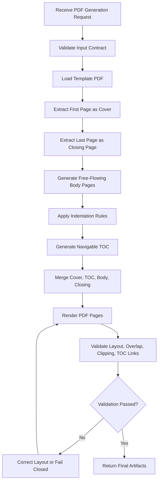

# Azure SRE Agent Skill: PDF Creation

## 1. Purpose

This skill enables an Azure SRE Agent to generate professional PDF documents for Azure operations, reliability engineering, FinOps validation, compliance evidence, remediation planning, incident reviews, executive briefings, technical reports, and SOPs.

The skill uses an approved enterprise PDF template:

- The first page of the attached template is used as the PDF cover page.
- The last page of the attached template is used as the PDF closing page.
- All pages between the cover and closing pages are dynamically generated as free-flowing pages.
- The document includes a navigable table of contents.
- The document enforces proper indentation, safe margins, and no-overlap layout validation.

## 2. Mandatory Capabilities

### 2.1 Proper Indentation

The skill must apply consistent indentation across headings, paragraphs, bullets, numbered lists, tables, captions, callouts, and appendices.

```yaml
indentation_rules:
  page_margin_left: 0.75in
  page_margin_right: 0.75in
  page_margin_top: 0.65in
  page_margin_bottom: 0.65in
  section_heading_indent: 0.00in
  subsection_heading_indent: 0.15in
  body_text_indent: 0.00in
  bullet_level_1_indent: 0.25in
  bullet_level_2_indent: 0.45in
  bullet_level_3_indent: 0.65in
  table_cell_padding: 0.08in
  caption_indent: 0.00in
```

### 2.2 No Overlapping

The skill must prevent and validate against:

```yaml
forbidden_layout_issues:
  - overlapping_text_blocks
  - overlapping_images
  - overlapping_tables
  - text_over_table
  - text_over_footer
  - header_body_collision
  - footer_body_collision
  - chart_label_overlap
  - clipped_table_rows
  - clipped_paragraphs
  - image_outside_page_boundary
  - content_outside_safe_area
```

If overlap is detected, the skill must automatically attempt correction by increasing spacing, wrapping long text, splitting tables, moving content to the next page, resizing visuals, or regenerating the document. If correction fails, the skill must fail closed.

### 2.3 Navigable Table of Contents

The skill must generate a table of contents immediately after the cover page.

```yaml
toc_requirements:
  enabled: true
  position: after_cover_page
  include_page_numbers: true
  include_clickable_links: true
  include_sections: true
  include_subsections: true
  max_depth: 3
  regenerate_after_pagination: true
```

### 2.4 Template-Based Cover and Closing Pages

```yaml
template_usage:
  input_template: templates/template.pdf
  use_first_page_as_cover: true
  use_last_page_as_closing_page: true
  preserve_template_visuals: true
  preserve_template_branding: true
  preserve_template_footer: true
  allow_cover_text_overlay: true
  allow_closing_text_overlay: false
```

### 2.5 Free-Flowing Middle Pages

```yaml
middle_page_behavior:
  layout: free_flowing
  auto_page_breaks: true
  preserve_section_order: true
  support_dynamic_content_length: true
  split_sections_when_required: true
  avoid_large_blank_spaces: true
  repeat_table_headers: true
  keep_heading_with_next_paragraph: true
```

## 3. Supported Document Types

```yaml
supported_document_types:
  - azure_sre_assessment_report
  - azure_sre_health_report
  - azure_finops_report
  - remediation_plan
  - incident_review_report
  - compliance_evidence_report
  - executive_briefing
  - architecture_summary
  - sop_document
  - operational_readiness_report
  - dashboard_export_summary
```

## 4. Input Contract

The Azure SRE Agent must provide input matching `schemas/input.schema.json`.

Required top-level fields:

```yaml
required_fields:
  - document
  - template
  - layout
  - sections
  - output
```

Minimal input example:

```json
{
  "document": {
    "type": "azure_sre_assessment_report",
    "title": "Azure SRE Agent - Reliability Assessment Report",
    "subtitle": "Production Environment Review",
    "classification": "CONFIDENTIAL - INTERNAL USE ONLY",
    "reporting_period": "July 2026",
    "version": "1.0",
    "generated_by": "Azure SRE Agent",
    "author": "Azure SRE Platform Team"
  },
  "template": {
    "file_name": "templates/template.pdf",
    "use_first_page_as_cover": true,
    "use_last_page_as_closing_page": true
  },
  "layout": {
    "mode": "free_flowing",
    "page_size": "A4",
    "orientation": "portrait",
    "generate_toc": true,
    "clickable_toc": true,
    "validate_no_overlap": true,
    "apply_proper_indentation": true
  },
  "sections": [],
  "output": {
    "file_name": "azure-sre-report.pdf"
  }
}
```

## 5. Output Contract

The skill returns:

```yaml
outputs:
  - final_pdf
  - validation_summary_json
  - render_preview_images
  - generation_log
```

Example response:

```json
{
  "status": "success",
  "pdf_file": "azure-sre-report.pdf",
  "page_count": 10,
  "toc_generated": true,
  "toc_clickable": true,
  "cover_page_from_template": true,
  "closing_page_from_template": true,
  "layout_validation": {
    "proper_indentation": true,
    "no_overlap_detected": true,
    "no_text_clipping": true,
    "no_table_overflow": true,
    "no_image_overflow": true
  },
  "warnings": [],
  "errors": []
}
```

## 6. Execution Workflow



## 7. Security Controls

The skill must scan for sensitive values before final PDF delivery.

```yaml
security_controls:
  scan_for_secrets: true
  redact_if_enabled: true
  fail_closed_on_unredacted_secret: true
  apply_confidentiality_footer: true
  prevent_token_exposure: true
  prevent_connection_string_exposure: true
  prevent_private_key_exposure: true
```

Secret indicators:

```yaml
secret_patterns:
  - client_secret
  - password
  - connectionString
  - SharedAccessKey
  - Authorization: Bearer
  - BEGIN PRIVATE KEY
  - AccountKey=
```

## 8. Validation Rules

```yaml
validation_rules:
  pdf_exists: required
  pdf_non_empty: required
  page_count_greater_than_zero: required
  first_page_matches_template: required
  last_page_matches_template: required
  toc_exists: required
  toc_links_working: required
  proper_indentation_applied: required
  no_overlapping_content: required
  no_text_clipping: required
  no_table_clipping: required
  no_image_clipping: required
  all_required_sections_present: required
  render_validation_successful: required
```

## 9. Acceptance Criteria

The generated PDF is valid only when:

- The first page is created from the attached template cover page.
- The last page is created from the attached template closing page.
- Middle pages are free-flowing and dynamically paginated.
- Proper indentation is consistently applied.
- A navigable table of contents is present.
- TOC page numbers are correct.
- No text, image, chart, or table overlaps exist.
- No content is clipped or outside the safe page area.
- All pages render successfully.
- The final PDF is enterprise-ready.

## 10. Enhanced Formatting Requirements

### 10.1 Professionally Formatted Tables

The skill must generate tables that are readable, balanced, and suitable for enterprise distribution.

```yaml
table_formatting_rules:
  repeat_header_on_page_break: true
  use_header_background: true
  use_alternating_row_backgrounds: true
  use_outer_border: true
  use_light_grid_lines: true
  vertical_alignment: middle
  header_alignment: center
  narrative_cell_alignment: left
  short_value_alignment: center_when_supported
  minimum_cell_padding_left: 0.08in
  minimum_cell_padding_right: 0.08in
  minimum_cell_padding_top: 0.07in
  minimum_cell_padding_bottom: 0.07in
  avoid_equal_width_columns_when_content_differs: true
  calculate_column_widths_from_content: true
  preserve_readable_font_size: true
```

Tables must not look like raw spreadsheet dumps. The generator must choose column widths based on content length and column purpose. Short fields such as ID, severity, status, priority, date, owner, approval status, and change ticket should remain compact. Long narrative fields such as observation, impact, recommendation, and remediation detail should receive proportionally more width.

### 10.2 Word Boundary Protection

Words must not be broken between lines. The skill must wrap text only at valid word boundaries.

```yaml
word_wrapping_rules:
  split_long_words: false
  wrap_only_on_word_boundaries: true
  preserve_resource_names: true
  preserve_subscription_ids_when_not_masked: true
  preserve_ticket_ids: true
  preserve_urls_where_possible: true
  use_smaller_font_only_after_width_adjustment: true
  fail_or_warn_on_unbreakable_token_overflow: true
```

If an unbreakable token is wider than the available column, the skill must prefer the following sequence:

1. Increase the column width within the safe page area.
2. Reduce non-critical adjacent columns.
3. Move the table to a landscape middle page if allowed.
4. Split the table into multiple logical tables.
5. Emit a validation warning if the unbreakable token still cannot fit.

### 10.3 Template Pages With Written Content

The first and last pages must preserve the original attached template visuals and must also include generated document content overlaid on top of the template.

```yaml
template_content_overlay:
  cover_page:
    source: first_page_of_template_pdf
    preserve_original_template: true
    overlay_required: true
    overlay_fields:
      - document_title
      - document_subtitle
      - generated_by
      - reporting_period
      - environment_optional
      - classification
  closing_page:
    source: last_page_of_template_pdf
    preserve_original_template: true
    overlay_required: true
    overlay_fields:
      - closing_message
      - document_title
      - classification
```

The skill must not replace the template page with a newly generated blank page. It must use the actual PDF template page and merge generated text onto it.

### 10.4 Properly Formatted Navigable Table of Contents

The table of contents must be visually formatted and clickable.

```yaml
toc_formatting_rules:
  position: after_cover_page
  title: Table of Contents
  instruction_text: Select a section name to navigate directly to that section.
  format_as_structured_table: true
  header_background: '#EAF4FB'
  border_color: '#00B5E2'
  alternating_row_backgrounds: true
  clickable_section_names: true
  include_section_level: true
  indent_subsections: true
  max_depth: 3
```

The table of contents must be rebuilt after section changes. Clickable TOC entries must use PDF link annotations or equivalent named destinations/bookmarks.

## 11. Updated Acceptance Criteria

The PDF is acceptable only when all original criteria and the following enhanced criteria are met:

- Tables have readable column widths, header styling, padding, borders, and alternating row backgrounds.
- Words are not broken across lines during wrapping.
- The template cover page includes generated document content overlaid on the original template.
- The template closing page includes generated closing content overlaid on the original template.
- The table of contents is formatted as a clean, navigable section list.
- All TOC links resolve to the correct section bookmarks.

## 12. Table Structural Consistency Controls

The skill must guarantee that generated tables have a consistent relationship between column headers and row data before rendering.

```yaml
table_structure_controls:
  header_count_is_authoritative: true
  validate_each_row_cell_count: true
  auto_pad_missing_cells: true
  auto_merge_extra_cells_into_last_column: true
  reject_empty_column_headers: true
  reject_duplicate_column_headers: true
  calculate_one_column_width_per_header: true
  fail_if_column_width_count_differs_from_header_count: true
```

Rendering rules:

- The number of rendered cells in every row must exactly match the number of column headers.
- Missing cells must be padded with blank values before rendering.
- Extra cells must be merged into the final column using a visible separator so no data is silently lost.
- The table generator must ensure the number of calculated column widths exactly matches the header count.
- If width calculation fails, the PDF generation must fail closed.
- Table rows must use controlled padding, row backgrounds, and grid lines to prevent visual bleeding between rows and columns.
- Long values must wrap within their own cell and must not render over neighboring cells.

Validation command:

```bash
python scripts/validate_table_structure.py examples/sre_assessment_input.json --summary out/table_structure_summary.json
```

## 13. Strict Table Cell Fitment Controls

The skill must enforce strict table cell fitment before PDF rendering. Table content must stay inside cell boundaries without overlapping neighboring cells, row boundaries, grid lines, headers, or footer areas.

```yaml
table_cell_fitment_controls:
  measure_longest_unbreakable_token: true
  calculate_minimum_required_width_per_column: true
  include_padding_in_width_calculation: true
  scale_font_within_allowed_range: true
  split_wide_tables_into_column_chunks: true
  fail_closed_if_single_unbreakable_token_cannot_fit: true
  preserve_no_word_break: true
  prevent_cell_text_overlap: true
  prevent_cell_text_overflow: true
  prevent_row_boundary_overflow: true
```

Rendering sequence:

1. Normalize header and row structure.
2. Measure the longest unbreakable token in every column.
3. Calculate each column's minimum safe width using token width, font size, padding, and safety buffer.
4. Use preferred widths only when the full table fits within the safe page area.
5. Reduce table font size in controlled steps only when required.
6. Split very wide tables into sequential column chunks when all columns cannot fit safely together.
7. Fail closed if a single unbreakable token cannot fit in the available page width without breaking the word.

This ensures no word break, no hidden overflow, no visual bleeding between cells, and no false success when table content cannot safely fit.

## 14. No-Overflow Fitment Validation

The skill must run predictive fitment validation before PDF generation whenever table sections are present.

```yaml
predictive_table_fitment_validation:
  enabled: true
  validator: scripts/validate_table_fitment.py
  measure_text_in_points: true
  account_for_cell_padding: true
  account_for_safety_buffer: true
  detect_unbreakable_token_overflow: true
  require_column_chunking_when_needed: true
  fail_before_render_if_fitment_impossible: true
```

Validation command:

```bash
python scripts/validate_table_fitment.py examples/sre_assessment_input.json --summary out/table_fitment_summary.json
```

## 15. Attached Report Template Usage

The skill now supports the attached report template in DOCX format as the authoritative source for the report first and last pages.

```yaml
attached_report_template_usage:
  accepted_template_formats:
    - docx
    - pdf
  default_template: templates/template.docx
  runtime_conversion:
    docx_to_pdf: true
    conversion_engine: LibreOffice headless
  first_page:
    source: first page of converted template
    preserve_template_visuals: true
    overlay_generated_content: true
    required_content:
      - document_title
      - document_subtitle
      - generated_by
      - reporting_period
      - environment_when_available
      - classification
  last_page:
    source: last page of converted template
    preserve_template_visuals: true
    overlay_generated_content: true
    required_content:
      - closing_message
      - document_title
      - classification
  middle_pages:
    layout: free_flowing
    source: generated_report_content
    must_not_use_fixed_template_background: true
```

Rules:

- The first report page must always come from the first page of the attached template.
- The last report page must always come from the last page of the attached template.
- The first and last pages must not be left blank; generated content must be written on both pages.
- All middle pages must remain free-flowing generated content pages.
- Existing functionality for formatted TOC, no word break, table fitment, no overlap validation, and render validation must remain enabled.

## 16. Template Preservation Validation

The skill must validate that the attached template content is preserved in the generated report output.

```yaml
template_preservation_validation:
  enabled: true
  validator: scripts/validate_template_usage.py
  validate_template_source_exists: true
  convert_docx_template_to_pdf_for_validation: true
  compare_generated_first_page_to_template_first_page: true
  compare_generated_last_page_to_template_last_page: true
  allow_generated_overlay_content: true
  require_same_page_size_for_template_pages: true
  require_visual_preservation_score: true
  minimum_visual_preservation_score: 0.82
  require_first_page_overlay_text: true
  require_last_page_overlay_text: true
  fail_closed_on_template_validation_failure: true
```

Validation command:

```bash
python scripts/validate_template_usage.py out/sample_sre_assessment_docx_template.pdf \
  --template templates/template.docx \
  --summary out/template_usage_summary.json
```

The validation must confirm:

- The template source exists.
- The template can be converted to PDF when provided as DOCX.
- The generated first page preserves the first page of the attached template.
- The generated last page preserves the last page of the attached template.
- The generated first page contains report content written on the template.
- The generated last page contains closing content written on the template.
- Middle pages remain free-flowing and are not forced into the template background.

## 17. PNG Background First and Last Page Mode

The skill can use attached PNG images as the report first and last page backgrounds.

```yaml
png_background_page_mode:
  enabled: true
  default_first_page_background: templates/Page_1.png
  default_last_page_background: templates/Page_2.png
  first_page_source: attached Page 1.png
  last_page_source: attached Page 2.png
  preserve_background_image_content: true
  overlay_report_content_on_first_page: true
  overlay_report_content_on_last_page: true
  middle_pages:
    layout: free_flowing
    generated_from_report_sections: true
    do_not_use_background_images: true
```

Rules:

- The first PDF page must use `Page_1.png` as a full-page background.
- The last PDF page must use `Page_2.png` as a full-page background.
- Generated report content must be written on top of both background pages.
- Middle pages must remain free-flowing generated report pages.
- Existing functionality for formatted TOC, strict table fitment, no word break, no overlap detection, render validation, and security scanning must remain enabled.

Validation command:

```bash
python scripts/validate_background_usage.py out/sample_sre_assessment_png_background.pdf \
  --first-background templates/Page_1.png \
  --last-background templates/Page_2.png \
  --summary out/background_usage_summary.json
```
